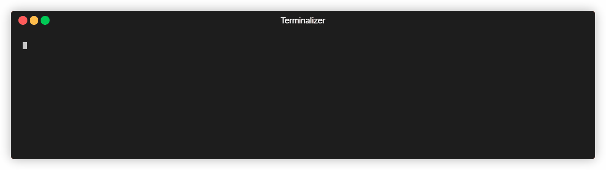
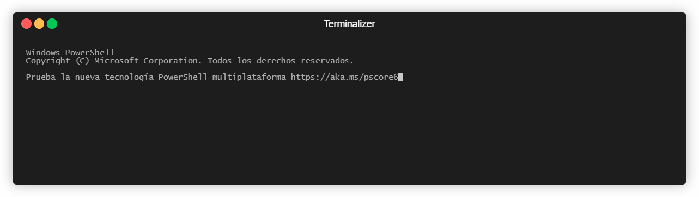

# Markdown Links

## Índice

* [1. Preámbulo](#1-preámbulo)
* [2. Resumen del proyecto](#2-resumen-del-proyecto)
* [3. Guía de instalación](#3-guía-de-instalación)
* [4. Manual de uso](#4-manual-de-uso)
* [5. Test](#5-test)

***

## 1. Preámbulo

[Markdown](https://es.wikipedia.org/wiki/Markdown) es un lenguaje de marcado
ligero muy popular entre developers. Es usado en muchísimas plataformas que
manejan texto plano (GitHub, foros, blogs, ...), y es muy común
encontrar varios archivos en ese formato en cualquier tipo de repositorio
(empezando por el tradicional `README.md`).

Estos archivos `Markdown` normalmente contienen _links_ (vínculos/ligas) que
muchas veces están rotos o ya no son válidos y eso perjudica mucho el valor de
la información que se quiere compartir.

Dentro de una comunidad de código abierto, nos han propuesto crear una
herramienta usando [Node.js](https://nodejs.org/), que lea y analice archivos
en formato `Markdown`, para verificar los links que contengan y reportar
algunas estadísticas.

## 2. Resumen del proyecto

<p align="center"></p>

mdLinks es una biblioteca creada con JavaScript y Node.js, con la que es posible identificar si el archivo pasado a través de una ruta es .md, revisa si contiene enlaces, si la búsqueda anterior resulta positiva la misma permite validar el estado de los links y también tiene la posibilidad de retornar estadísticas básicas como: links totales, únicos y rotos.

## 3. Guía de instalación

- Para hacer uso de la biblioteca por línea de comando:

Escribe en la terminal: 
```sh
npm i carolina-preciado-md-links -g
```
- Para hacer uso de la biblioteca directamente:

Escribe en la terminal:
```sh
npm i carolina-preciado-md-links 
```
- Luego importar con: 
```sh
const { mdLinks } = require('carolina-preciado-md-links')
```
## 4. Manual de uso

### Si quieres hacer la consulta por la linea de comando tendrás las siguientes opciones:

- mdLinks path-to-file

#### Ejemplo:
```sh
mdLinks prueba.md
```
Esto te arrojara un listado con file, href y text.
```sh
prueba.md https://es.wikipedia.org/wiki/Markdown Markdown 
prueba.md https://user-images.githubusercontent.com/110297/42118443-b7a5f1f0-7bc8-11e8-96ad-9cc5593715a6.jpg md-links
prueba.md https://nodejs.org/es/ Node.js
prueba.md https://www.youtube.com/ youtube
prueba.md https://www.youtub.com/ youtube
```
- mdLinks path-to-file [options]

En [options] puedes pasar: mdLinks path-to-file --validate 
  
#### Ejemplo:
```sh
mdLinks prueba.md --validate
```
Esto te arrojara un listado con file, href, el status de la respuesta recibida a la petición HTTP a dicha URL, Ok o Fail y el text.
```sh
prueba.md https://es.wikipedia.org/wiki/Markdown 200 Ok Markdown
prueba.md https://user-images.githubusercontent.com/110297/42118443-b7a5f1f0-7bc8-11e8-96ad-9cc5593715a6.jpg 200 Ok md-links        
prueba.md https://nodejs.org/es/ 200 Ok Node.js
prueba.md https://www.youtube.com/ 200 Ok youtube
prueba.md https://www.youtub.com/ 0 Fail youtube
```
En [options] también puedes pasar: mdLinks path-to-file --stats

#### Ejemplo:
```sh
mdLinks prueba.md --stats   
```
Si pasas la opción --stats el output (salida) será un texto con estadísticas básicas sobre los links.
```sh
Total: 5
Unique: 5
```
También puedes combinar --validate y --stats (en ese orden):
  
mdLinks path-to-file --validate --stats
  
Para obtener estadísticas que necesites de los resultados de la validación.

#### Ejemplo:
```sh
mdLinks prueba.md --validate --stats

{ total: 5, unique: 5, broken: 1 }
```
<p align="center"></p>

### Si quieres hacer la consulta directamente desde el archivo de importación escribe:
```sh
  mdLinks(path-to-file, {options})
  .then((res) => {
    console.log(res);
    return res;
  })
  .catch((err) => console.log(err, "Esto es un error  de mdlink"));
```
  - las options pueden ser:
```sh
  {validate: true}
  {validate: false}
  {validate: true, stats: true}
```
  #### Ejemplos:

- Estos ejemplos están creados con un archivo llamado indexPrueba.md

Tu archivo se debería ver de la siguiente manera, en la primera línea el require y luego el llamado de la función la cual retorna una promesa.
```sh
const { mdLinks } = require('carolina-preciado-md-links')

mdLinks('./prueba.md', {validate: true})
  .then((res) => {
    console.log(res);
    return res;
  })
  .catch((err) => console.log(err, "Esto es un error  de mdlink"));
```
Seguidamente debes ir a la terminal y pasar lo siguiente:

node name-the-file
```sh
node indexPrueba.js
```
- El retorno será 
```sh
./prueba.md https://es.wikipedia.org/wiki/Markdown 200 Ok Markdown
./prueba.md https://user-images.githubusercontent.com/110297/42118443-b7a5f1f0-7bc8-11e8-96ad-9cc5593715a6.jpg 200 Ok md-links      
./prueba.md https://nodejs.org/es/ 200 Ok Node.js
./prueba.md https://www.youtube.com/ 200 Ok youtube
./prueba.md https://www.youtub.com/ 0 Fail youtube
```
- Si pasas {validate: false} 
```sh
const { mdLinks } = require('carolina-preciado-md-links')

mdLinks('./prueba.md', {validate: false})
  .then((res) => {
    console.log(res);
    return res;
  })
  .catch((err) => console.log(err, "Esto es un error  de mdlink"));
```
Seguidamente debes ir a la terminal y pasar lo siguiente:

node name-the-file
```sh
node indexPrueba.js
```
- El retorno será
```sh
./prueba.md https://es.wikipedia.org/wiki/Markdown Markdown
./prueba.md https://user-images.githubusercontent.com/110297/42118443-b7a5f1f0-7bc8-11e8-96ad-9cc5593715a6.jpg md-links
./prueba.md https://nodejs.org/es/ Node.js
./prueba.md https://www.youtube.com/ youtube
./prueba.md https://www.youtub.com/ youtube
```
- Si pasas {validate: true, stats: true}
```sh
const { mdLinks } = require('carolina-preciado-md-links')

mdLinks('./prueba.md', {validate: true, stats: true})
  .then((res) => {
    console.log(res);
    return res;
  })
  .catch((err) => console.log(err, "Esto es un error  de mdlink"));
```
Seguidamente debes ir a la terminal y pasar lo siguiente:

node name-the-file
```sh
node indexPrueba.js
```
- El retorno será
```sh
{ total: 5, unique: 5, broken: 1 }
```
<p align="center"></p>

## 5. Test

Para realizar los test debes agregar el siguiente comando en la terminar:
```sh
npm test
```
- NOTA:

Para poder correr los test debes tener instalado jest. En caso de no tenerlo te comparto el enlace para que realices la descarga y la configuración correspondiente: https://jestjs.io/docs/getting-started 


